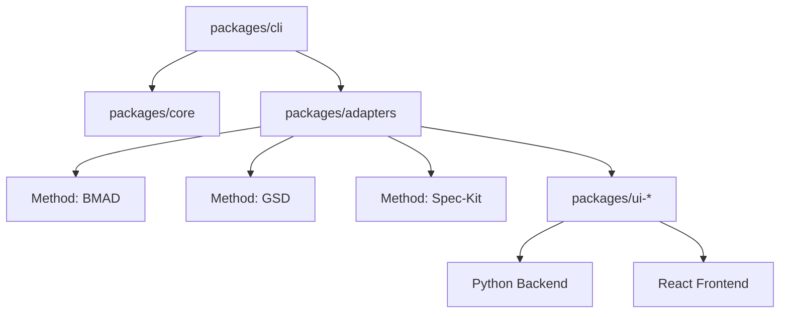

# 🚀 SDD UI Plugin

> **Unified UI bridge for BMAD, GSD, and Spec-Kit methods.**


[](https://opensource.org/licenses/MIT)
[](https://www.npmjs.com/)
[](https://nodejs.org/)

---

## 💡 Why SDD UI?

In the world of CLI productivity tools, context is often scattered across terminal windows. **SDD UI Plugin** bridges this gap by providing a **unified, interactive web interface** for your favorite workflow methods: `bmad`, `gsd`, and `spec-kit`.

Stop juggling terminal tabs and start visualizing your progress with a modern, data-driven dashboard.

---

## ✨ Key Features

- **🎯 Unified Bootstrap**: One command to detect and install all necessary binaries and UI artifacts.
- **📊 Real-time Visualization**: Interactive dashboards for roadmaps, state management, and specifications.
- **🔌 Method Adapters**: Specialized adapters for BMAD, GSD, and Spec-Kit that handle the heavy lifting.
- **🚀 One-Click Launch**: Seamlessly transition from CLI to Browser with `sdd-ui start`.
- **🛠 Health Checks**: Built-in `doctor` command to ensure your environment is primed for productivity.

---

## 🔗 Method Repositories

| Method | Repository |
| :--- | :--- |
| **GSD** | [gsd-build/get-shit-done](https://github.com/gsd-build/get-shit-done) |
| **BMAD** | [bmad-code-org/BMAD-METHOD](https://github.com/bmad-code-org/BMAD-METHOD) |
| **Spec-Kit** | [github/spec-kit](https://github.com/github/spec-kit) |

---

## 🚦 Quick Start

### 1. Bootstrap your project
Initialize a new workspace or add SDD UI to an existing one. The `bootstrap` command automatically detects missing tools and installs them.

```bash
# Bootstrap everything in the current directory
npx github:danielvm-git/sdd-ui-plugin bootstrap all --target-dir ./
```

### 2. Start the UI
Launch the interactive dashboard for a specific method.

```bash
# Launch the GSD (Get-Shit-Done) UI
npx github:danielvm-git/sdd-ui-plugin start gsd
```

---

## 🛠 Command Reference

| Command | Action |
| :--- | :--- |
| `bootstrap <method\|all>` | Detects and **auto-installs** method binaries and UI artifacts. |
| `install <method\|all>` | Re-installs UI artifacts and manifest files in the target project. |
| `update <method\|all>` | Forces a **refresh** of binaries and UI artifacts in an existing project. |
| `start <method>` | Launches the UI backend and opens your browser. |
| `status <method\|all>` | Inspects the health and installation state of adapters. |
| `doctor <method\|all>` | Runs diagnostics (Node/Python versions, path accessibility). |
| `version` | Displays the current CLI and core version. |

### Global Flags
- `--target-dir <path>`: Directory to bootstrap (defaults to `.`).
- `--project <path>`: Specific project path for `install` and `start`.
- `--global`: Force global installation during bootstrap (skips prompt).
- `--local`: Force local installation during bootstrap (skips prompt).
- `--dry-run`: Preview actions without making changes.
- `--port <number>`: Override default UI port.

---

## 🏗 Architecture

SDD UI is built as a modular monorepo for maximum extensibility:

- **`packages/cli`**: The unified entry point for all commands.
- **`packages/core`**: Shared logic for process execution and manifest management.
- **`packages/adapters`**: The logic layer that translates method-specific data into the SDD format.
- **`packages/ui-*`**: Modern React/Vite frontends and Python-based backends for each method.



---

## 👩‍💻 Development

### Setup
```bash
git clone https://github.com/danielvm-git/sdd-ui-plugin.git
cd sdd-ui-plugin
npm install
```

### Running Locally
```bash
# Run the CLI from source (with your local changes)
npm start -- start gsd

# Or use the link for a global command
npm link
sdd-ui start gsd
```

### Testing
```bash
# Run all tests
npm test
```

---

## 📄 License

Distributed under the MIT License. See `LICENSE` for more information.

---

## 🤝 Contributing

Contributions are what make the open-source community such an amazing place to learn, inspire, and create. Any contributions you make are **greatly appreciated**.

1. Fork the Project
2. Create your Feature Branch (`git checkout -b feature/AmazingFeature`)
3. Commit your Changes (`git commit -m 'Add some AmazingFeature'`)
4. Push to the Branch (`git push origin feature/AmazingFeature`)
5. Open a Pull Request

---

**Built with ❤️ for the Developer Community.**
